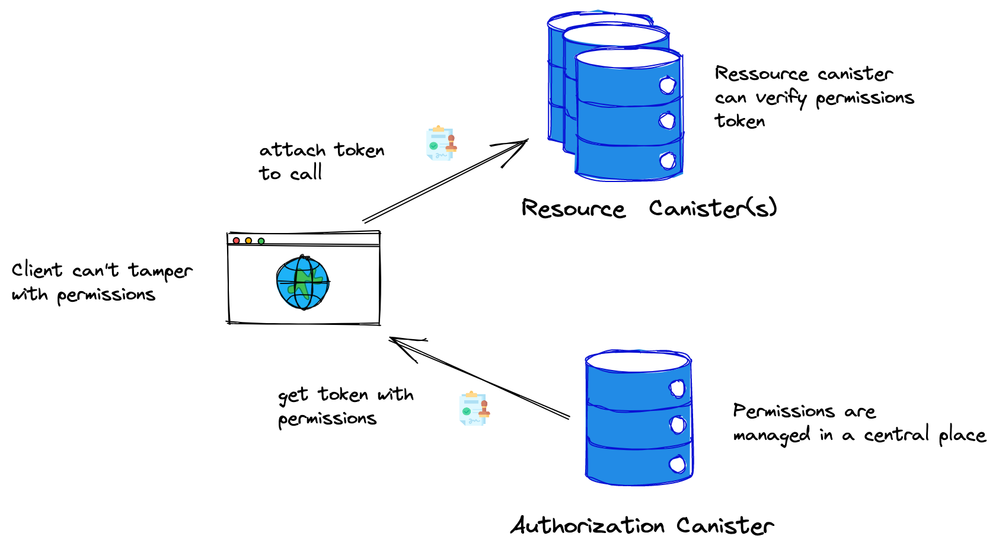
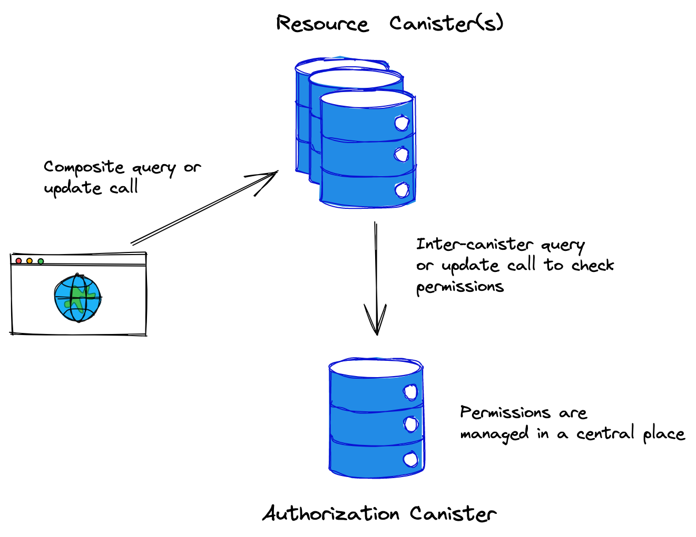

# Access Control on the Internet Computer


**Note:** This is a demonstration project and hasn't been audited. Please use it for inspiration only.

## Motivation

In microservice architectures, it's common to centralize access control by having a single authorization service that manages all permissions. This simplifies permission management but raises the question of how resource services learn about the permissions. There are two main patterns:

1) Tokens: A client requests an authorization token from the authorization service and invokes it at the resource service. Here, the resource service does not need to directly communicate with the authorization service.
2) Validation endpoint: The authorization server exposes a validation endpoint that the resource service can use to validate permissions.


On the Internet Computer, we can use the same patterns and this example application demonstrates these patterns.

## Architecture

We have the following two canisters:

### Authorization Canister

The authorization canister has the following interface:

```
type token = blob;
type target = text;
service : {
    "update_permissions": (principal, target, bool) -> (text); // update permissions of a specific user and target (by its function name)
    "read_permissions_certified": ()              -> (opt token) query; // fetch permissions as token
    "verify_permissions": (principal, target)       -> (bool, nat) query; // verify permissions
}
```

The permissions are maintained in a certified data structure using the `ic-certified-map` crate and the [certified data](https://internetcomputer.org/how-it-works/response-certification/) functionality of the Internet Computer. When a client fetches the token with the `read_permissions_certified` function, then this token includes a path to the state root hash of the Internet Computer signed by the subnet together with a delegation from the NNS subnet. Thereby, the resource canister can verify the authenticity of the token given the IC's public key and the client can't tamper with the token.
The token also includes a timestamp to validate freshness. 
 

### Resource canister

The resource canister is the [counter example canister](https://github.com/dfinity/examples/tree/master/rust/counter) with added permissions.

```
type token = blob;
service : (principal) -> {
    "get": (opt token)      -> (nat, nat) query;
    "get_composite": (opt blob) -> (nat, nat) query;
    "set": (nat, opt token) -> (nat);
    "inc": (opt token)      -> (nat);
```

The second number in the return values of the first two methods and the number in the return values of the last two methods is the number of instructions used for the verification of the permissions.

Note that we have to provide a principal as an init argument. This allows to register the authorization canister. We need the principal of the authorization canister to verify that the tokens have been "signed" by the authorization canister, or to know how to call the `verify_permissions` endpoints.

Furthermore, we note that each endpoint has an optional argument to provide the authorization token, and that there's an additional endpoint called `get_composite`. This is a composite query that allows performing an inter-canister query call to the `verify_permissions` endpoint.


### Patterns

#### Token-based access control



#### Validation endpoint



## Comparison


|          |           Token          |       Inter-canister Call      |
|----------|--------------------------|--------------------------------|
| DevX     |  :thinking:	          |       :grinning:	           |
| Latency  |  :grinning:	          |       :grinning: (same subnet) |
| Cost     |  :goberserk:             |    :slightly_smiling_face:   |
| Security |  :grinning:              |       :grinning:               |

### Developer Experience

The token-based approach adds quite a bit of complexity. As a client, we need to fetch the authorization token and have logic to get a new one if it is expired. Furthermore, there we need to verify the permissions in the certified map, as well as verify the IC certificate. This could be abstracted away in a library though. The token-based approach is also currently out of reach for Motoko developers, since we don't have a library for a certified map, as well as a library for BLS signature verification.

The inter-canister call to the validation endpoint, on the other hand, is very easy to implement in Rust and Motoko.

### Latency & Cost

As long as both canisters are on the same subnet there is no big difference in latency between the two approaches. With the availability of composite queries, it could be even faster to have a composite query than to do the token verification.
If the canisters were on different subnets, then the token-based approach would provide lower latency.

On the cost side, let's look at the token approach first: 
Token size: 221 bytes
Ingress msg byte cost: 1'000 * 221 = 221'000 cycles (we don't need to take the cost for the ingress message itself into account, since it is needed for both approaches)
Instructions for certificate verification: 463'975'738 ~> 185'590'000 cycles

Total: 185'811'000 cycles

For the inter-canister call approach, we have call and reply, which cost 260'000 cycles each + 3 times the cost for update message execution of 590'000 cycles => 2'290'000 cycles.
The data transferred is rather small, so we neglect this cost hee.

The instructions used for verification of the permissions by the authorization canister are also quite small with about 50'000 instructions => 20000 cycles

Total: 2'310'000 cycles

=> The token-based approach is approx. 80 times as expensive as the inter-canister call-based approach.

### Security

 There are two points to mention with respect to security:
 1) The inter-canister call approach has the advantage that permissions can immediately be revoked (if there's no caching).
 2) You need to be aware of the implications of inter-canister calls in general. See the relevant section in the [Security Best Practices](https://internetcomputer.org/docs/current/references/security/rust-canister-development-security-best-practices#inter-canister-calls-and-rollbacks).

## Demo

### Local demo

You can run a demo flow that will deploy the canisters, set some permissions, fetch a token and perform some operations on the resource canister with and without the authorization token. Furthermore, the runtime of the operations will be written to the terminal.

You can run the demo flow with the following command:

```
./demo.sh
```

### Live deployment

I've deployed the canisters to the IC on a single subnet. You can interact with them.

```
Resource canister: 62hqk-naaaa-aaaap-qa5oa-cai
Authorization canister: 65gw6-ayaaa-aaaap-qa5oq-cai
```

Some example calls (or a complete flow) can be found in [`demo_ic.sh`](/demo_ic.sh).


## Final Remarks

The authorization canister does not use stable memory, as such all permissions are lost on upgrade.


## What's next?

If you want to work on production-ready libraries or a configurable authorization canister, then get in contact with me or apply for a developer grant at [https://dfinity.org/grants](https://dfinity.org/grants).


