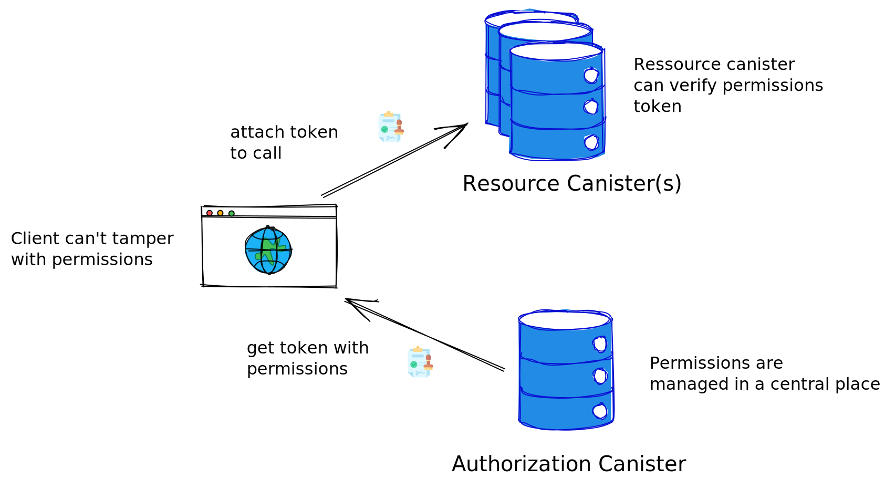
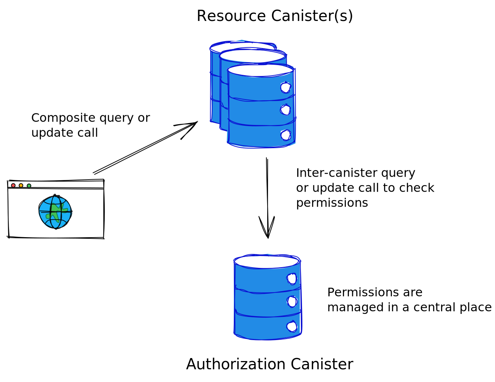

# Access Control on the Internet Computer


**Note:** This is a demonstration project and hasn't been audited. Please use it for inspiration only.

## Motivation

In microservice architectures, it's common to centralize access control by having a single authorization service that manages all permissions. This simplifies permission management but raises the question of how resource services learn about the permissions. There are two main patterns:

1) Tokens: A client requests an authorization token from the authorization service and invokes it at the resource service. Here, the resource service does not need to directly communicate with the authorization service.
2) Validation endpoint: The authorization server exposes a validation endpoint that the resource service can use to validate permissions.


On the Internet Computer, we can use the same patterns and this example application demonstrates these patterns.

## Architecture

We have the following two canisters:

### Authorization Canister

The authorization canister has the following interface:

```
type token = blob;
type target = text;
service : {
    "update_permissions": (principal, target, bool) -> (text); // update permissions of a specific user and target (by its function name)
    "read_permissions_certified": ()              -> (opt token) query; // fetch permissions as token
    "verify_permissions": (principal, target)       -> (bool) query; // verify permissions
}
```

The permissions are maintained in a certified data structure using the `ic-certified-map` crate and the [certified data](https://internetcomputer.org/how-it-works/response-certification/) functionality of the Internet Computer. When a client fetches the token with the `read_permissions_certified` function, then this token includes a path to the state root hash of the Internet Computer signed by the subnet together with a delegation from the NNS subnet. Thereby, the resource canister can verify the authenticity of the token given the IC's public key and the client can't tamper with the token.
The token also includes a timestamp to validate freshness. 
 

### Resource canister

The resource canister is the [counter example canister](https://github.com/dfinity/examples/tree/master/rust/counter) with added permissions.

```
type token = blob;
service : (principal) -> {
    "get": (opt token)      -> (nat) query;
    "get_composite": (opt blob) -> (nat) query;
    "set": (nat, opt token) -> ();
    "inc": (opt token)      -> ();
```
Note that we have to provide a principal as an init argument. This allows to register the authorization canister. We need the principal of the authorization canister to verify that the tokens have been "signed" by the authorization canister, or to know how to call the `verify_permissions` endpoints.

Furthermore, we note that each endpoint has an optional argument to provide the authorization token, and that there's an additional endpoint called `get_composite`. This is a composite query that allows performing an inter-canister query call to the `verify_permissions` endpoint.


### Patterns

#### Token-based access control



#### Validation endpoint



## Comparison

TODO

## Demo

### Local demo

You can run a demo flow that will deploy the canisters, set some permissions, fetch a token and perform some operations on the resource canister with and without the authorization token. Furthermore, the runtime of the operations will be written to the terminal.

You can run the demo flow with the following command:

```
./demo.sh
```

### Live deployment

I've deployed the canisters to the IC on a single subnet. You can interact with them.

```
Resource canister: 62hqk-naaaa-aaaap-qa5oa-cai
Authorization canister: 65gw6-ayaaa-aaaap-qa5oq-cai
```

Some example calls (or a complete flow) can be found in [`demo_ic.sh`](/demo_ic.sh).


## What's next?

If you want to work on production-ready libraries or a configurable authorization canister, then get in contact with me or apply for a developer grant at [https://dfinity.org/grants](https://dfinity.org/grants).


